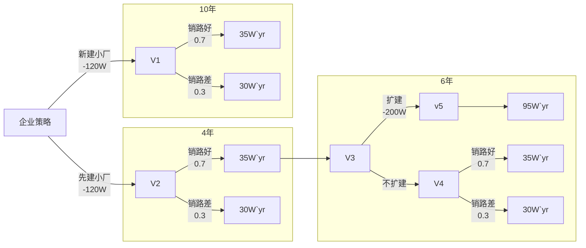

某企业为扩大某产品的生产，拟建设新厂，据市场预测产品销路好的概率为0.7，销路差的概率为0.3，有三种方案可供企业选择:

- 方案1，新建小厂，需投资120万元。销路好时，每年可获利35万元；销路差时，每年仍可获利30万元。服务期为10年。
- 方案2，先建小厂，投资及获利情况与方案1相同，4年后销路好时考虑扩建(并不一定扩建)，再扩建需追加投资200万元，服务期为6年，估计每年获利95万元。

**注意：将服务期看作一个整体，不需要每年考虑销路好还是不好。**
试用树状图来描述各种方案在不同自然状态下的收益，据此计算每种方案的期望收益值并选择方案
$$
状态节点V_1的期望效益值为：E(V_1) = -120 + (0.7 * 35 + 0.3 * 30)* 10 = 215(万元)\\
状态节点V_4的期望效益值为：E(V_4) = (0.7 * 35 + 0.3 * 30)* 6= 201(万元)  \\

状态节点V_5的期望效益值为：E(v_5) = -200 + 6 * 95 = 370(万元)  \\
由于E(V_5)>E(V_4), 将E(V_5)的数据填入状态节点V_3，令E(v_3) =E(v_5) = -200 + 6 * 95 = 370(万元)  \\
状态节点V_2的期望收益值为： E(V_2) = -120 + (0.7 * (35 * 4 + E(V_3)) + 0.3 * 30*10) = 327(万元)  \\
$$
每种方案的期望收益值：

只新建小厂：215万元 
先建小厂：327万元
先建小厂，四年内销路好，扩建：390万元 & (0.7 * n)
先建小厂，四年内销路好，不扩建：221万元 & (0.7 * (1-n))
先建小厂，四年内销路不好，不扩建：180万元 &(0.3)

决策为：先建小厂，四年后若效率好则选择扩建。

[注意事项]
电子版提交到: 15800412654@163.com， 文件名:学号名字\_第九章，邮件名:
学号_第九章
提交作业截止时间为2021年12月24日 12:00

