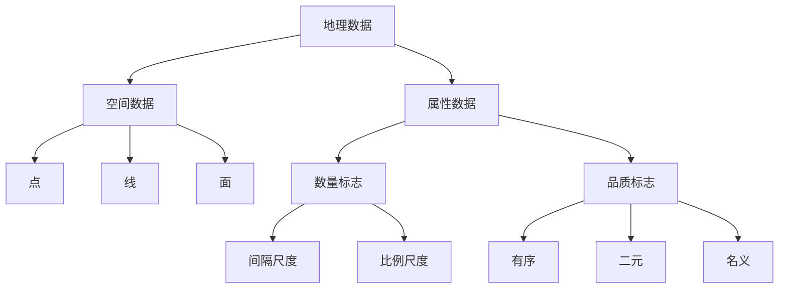
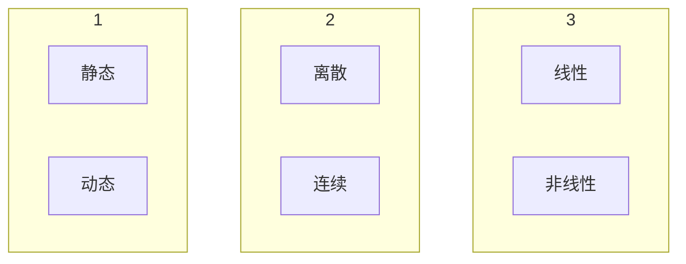
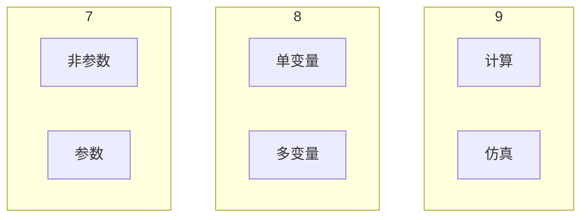
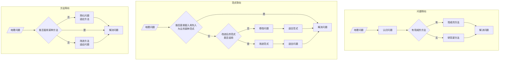
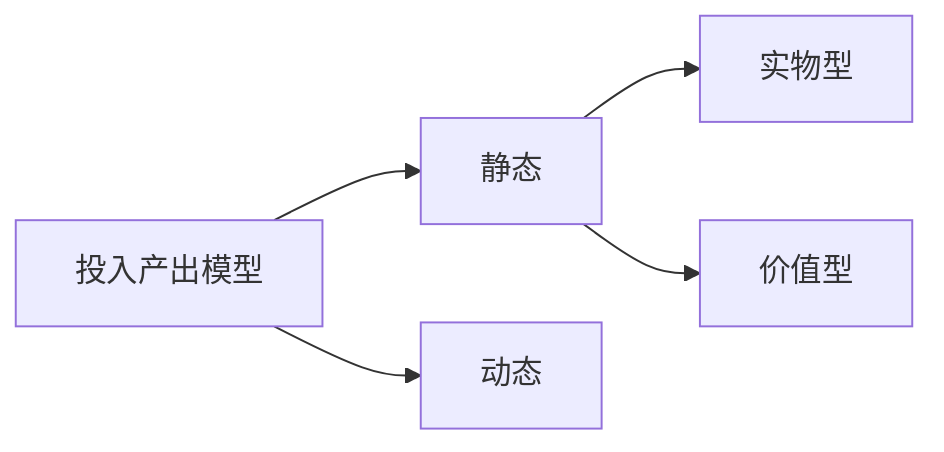
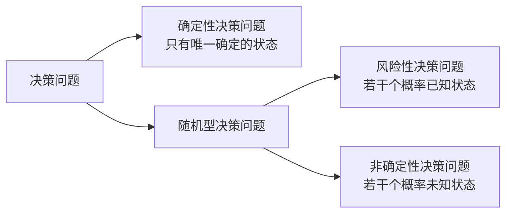

# 第一章 绪论

## 1.1 历史

区域学派，人地关系学派，景观学派

20世纪40年代主流学派**区域学派**

20世纪50年代末期开始，先在美国掀起了建立地理学法则的热潮(<font color='red'>计量运动</font>)

经济派，统计派，社会物理学派

四个发展阶段：

1. 50send-60send，把统计学方法引进地理学
2. 60send-70send，广泛应用多元统计分析方法和电子计算机技术
3. 70send-80send，概统，运筹，数物方法，计量经济，系统科学
4. 90s-，计量地理➡计算地理

## 1.2 评价和认识

**评价和认识**

1. 世界上的所有事物都可以用数值来度量。
2. 在现代地理学中，传统方法和数学方法之间并没有不可逾越的鸿沟


3. 数学方法，不仅是应用地理学研究中的预测、决策、规划及优化设计的工具，而且也是理论地理学研究中进行逻辑推理和理论演绎的手段。
4. 数学方法具有**外部局限性**（目前不清楚用什么方法去处理）和**内部局限性**（无法探求单纯用数学方法分析问题的深度）。对于复杂地理问题的研究，需要将多种方法结合起来，联合使用才能奏效。
5. 现代计量地理学，实质上就是数学方法与现代计算理论、计算方法和计算机技术在现代地理学研究领域内相互结合、相互渗透的产物。


**传统方法和数学方法的区别**

|          | 传统方法                 | 数学方法       |
| -------- | ------------------------ | -------------- |
| 推理方式 | 综合归纳                 | 理论演绎       |
|          | 考察、收集资料           | 观察实践       |
|          | 根据已有的概念体系条理化 | 先期模式       |
|          | 归纳概括                 | 提出假设       |
|          | 建立理论法则             | 对资料进行筛选 |
|          |                          | 建立模式       |
|          |                          | 反复检验       |
|          |                          | 建立理论和法则 |

## 1.3 应用和注意问题

应用：

分步型分析，相互关系分析，分类研究，网络分析，趋势面分析，空间相互作用分析，系统仿真研究，过程模拟与预测研究，空间扩散研究，空间行为研究，地理系统优化调控研究，地理系统复杂性研究，

注意问题：

1. 地理数据的筛选和质量检验
   1. 确定模型中的参数与初值
   2. 检验模型的正确性、合理性和有效性
2. 模型的建造
3. 与GIS的结合

# 第二章 地理数据

## 2.1 地理数据的类型

1. **空间数据**
   1. **点**，精确的地理位置点，或地理实体的抽象
   2. **线**，线状地物或点实体之间的联系
   3. **面**，空间上连续分布的地理景观或区域
2. **属性数据**
   1. **数量标志数据**
      1. **间隔尺度数据**，有量纲【温度，GDP，时间】
      2. **比例尺度数据**，量纲为1，指数或比例数【耕地指数，人口比】
   2. **品质标志数据**
      1. **有序数据**，测度标准不是连续的量，而是表示其顺序关系，与量无关。【特大城市，大城市，中等城市，小城市】
      2. **二元数据**，0/1是非判断问题【男女，两点间有无连线】
      2. **名义数据**，用数字表示地理实体、地理要素、地理现象或地理事件的状态类型




## 2.2 地理数据的基本特征

1. 数量化，形式化与逻辑化 	<font color='blue'>数学的基本特征</font>

   地理数据的数量化、形式化与逻辑化，是对地理问题进行数学描述和定量化研究的前提，是一切数学方法在地理学中应用的先决条件

2. 不确定性

   1. 地理系统的复杂性决定了地理数据的不确定性
   2. 各种原因导致的数据误差

3. 多种时空尺度

   1. 空间尺度 【全球，洲际，国家，流域，地区，城市，社区】
   2. 时间尺度 【地质年代，低层年代，历史年代，天月季年】

4. 多维性  往往需要从空间、属性、时间三个方面进行综合描述

## 2.3-4 地理数据的采集与处理


统计步骤：


#### 未分组的平均值

$$
\bar{x} = \frac{1}{n}\sum^{n}_{i=1}x_{i}
$$

#### 分组的平均值

x_{i}：第i组的组中值【（min+max）/2】

f_{i}：第i组的频数（该组有几个数据）
$$
\bar{x} = \frac{\sum^{m}_{i=1} f_{i}x_{i}}{\sum^{m}_{i=1}f_{i}}
$$

#### 分组的中位数

L： 中位数所在组的下限

d：中位数所在组的组距

f_{m}：中位数所在组的频数

S_{m-1}：中位数所在组以下的累计频数
$$
M_{e} = L + d \frac{\frac{1}{2}\sum^{n}_{i=1} f_{i} - S_{m-1}}{f_{m}}
$$

#### 分组的众数

\Delta_{1}：众数组频数与下一组频数之差

\Delta_{2}：众数组频数与上一组频数之差
$$
M_{0}=L +d \frac{\Delta_{1}}{\Delta_{1} + \Delta_{2}}
$$

#### 极差

range(x)
$$
R = max\{ x_{i}\} -min\{ x_{i}\}
$$
**离差**

每一个地理数据与平均值的差
$$
d_{i} = x_{i} - \bar{x}
$$
离差平方和
$$
d^{2} = \sum^{n}_{i=1}(x_{i}-\bar{x})^{2}
$$
方差和标准差
$$
\sigma^{2} = \frac{1}{n}\sum^{n}_{i=1}(x_{i}-\bar{x})^{2}\\
\sigma = \sqrt{\frac{1}{n}\sum^{n}_{i=1}(x_{i}-\bar{x})^{2}}
$$
以样本方差对标准差进行无偏估计：
$$
S= \sqrt{\frac{1}{n-1}\sum^{n}_{i=1}(x_{i}-\bar{x})^{2}}
$$

#### **变异系数** 	

地理数据的相对变化程度
$$
C_{v} = \frac{S}{\bar{x}} = \frac{1}{\bar{x}}\sqrt{\frac{1}{n-1}\sum^{n}_{i=1}(x_{i}-\bar{x})^{2}}
$$

#### **偏度系数**	

测度了地理数据分布的不对称性
$$
g_{1} = \sum^{n}_{i=1}\frac{1}{n}(\frac{x_{i}-\bar{x}}{\sigma})^{3}
$$
g_{1}<0，负偏；

g_{1}>0，正偏；

g_{1}=0，对称分布


#### **峰度系数** 	

地理数据在均值附近的集中程度
$$
g_{2} = \sum^{n}_{i=1}\frac{1}{n}(\frac{x_{i}-\bar{x}}{\sigma})^4-3
$$
g_{2}=0： 符合标准正态分布；

g_{2}<0： 集中程度低于正态分布；

g_{2}>0： 集中程度高于正态分布。


## 2.5 集中化与均衡度指数

### 洛伦兹曲线与集中化指数

**洛伦兹曲线**：累计频率曲线

1. 将数据从大到小重新排序
2. 逐次计算累计百分比
3. 绘制(自然序号，累计百分比)曲线，axis equal
4. 加上集中分布（y=100）和均匀分布（y=x）两条曲线

上凸程度越大，表示该组数据越是集中于这个部分，bla

#### **集中化指数**

洛伦兹曲线的解析式：
$$
Y = f(X),\quad X=0,1,\ldots,n\\
A = \int^{n}_{0}f(X)dX
$$
R： 对角线以下三角形的面积

M：正方形的面积

A：曲线下方面积

集中化指数：
$$
I = \frac{A-R}{M-R}
$$
A：实际数据的累计百分比和

R：均匀分布的累计百分比和

M：集中分布的累计百分比和

### 基尼系数

对人口和收入两组数据进行比较分析，把横纵坐标均以累计百分比表示，作出洛伦兹曲线和集中化指数

1. 列出every人口/收入 占总区的比重p & w；
2. 计算every w/p；
3. 根据w/p值从大到小排序；
4. 按顺序分别计算p, w的累计值X, Y；
5. 以X, Y分别为横纵坐标，画洛伦兹曲线

基尼系数：
$$
G = 1 - 2\int^{1}_{0}f(X)dX
$$
近似计算：

按人均收入从低到高排序，分组

w_{i}：每组收入占比

p_{i}：每一组人口比重
$$
G = 1 - \sum^{n}_{i=1}p_{i}(2Q_{i}-w_{i})
\\
Q_{i} = \sum^{i}_{k=1}w_{k}是从第1组到第i组的累计比重。
$$
**G(0~1)越小，收入分配越平衡**

联合国规定：

G<0.2：收入分配高度平衡

0.2<G<0.3：收入分配比较均衡

0.3<G<0.4：收入分配相对合理

0.4<G<0.5：收入分配差距较大

G>0.6：收入分配差距悬殊

### 锡尔系数

描述经济发展、收入分配的均衡情况

锡尔系数T和L

T：收入比重加权

L：人口比重加权

y_{i}：收入占比

p_{i}：人口占比
$$
L = \sum^{n}_{i=1}p_{i}log(\frac{p_{i}}{y_{i}})\\
T = \sum^{n}_{i=1}y_{i}log(\frac{y_{i}}{p_{i}})\\
$$


**锡尔系数越大，收入分配差距越大**

# 第三章 地理建模

## 3.1 地理模型

模型分为比例模型、符号模型、模拟模型。

地理模型

真实的地理对象（过程、系统）的模仿物，可以用实物、逻辑符号、图形、表格、文字、数学公式、计算机软件来表示。

#### 地理模型的特点

1. 抽象性	在一定假设下对现实地理系统（过程）的简化，只包括了决定系统（过程）本质性的重要因素

2. 与原型的相似性     

3. 可验证性 可以用于实际问题的计算、分析、仿真、模拟，并且检验模型的有效性

   ​	理论上论证科学性

   ​	实践方法验证应用性

4. 目的性 

5. 多时空特征

   ​	空间尺度

   ​	时间尺度

   ​	空间尺度和时间尺度有一定的联系

6. 应用性 地理学的应用性决定了地理模型的应用性

#### 地理模型的功能

1. 认识地理问题的桥梁

   ​	古代地理学是以地理知识的记载为主体

   ​	近代地理学是对地理现象条理性归纳，并且对它们之间的关系进行解释性描述

   ​	现代地理学是把地球表层系统看成统一的整体，规范研究和实证研究并举

2. 地理科学发现的工具

   ​	思想上：充分认识地理复杂性问题，充分认识人地关系地域系统的复杂性

   ​	方法上：充分利用其他学科的最新成果和现代化技术

3. 综合研究的功能

地理模型的分类

```MERMAID
graph TB

表现形式 --> 实物 & 文字 & 图表 & 数学
```



```MERMAID
graph TB
subgraph 4
确定性 & 不确定性
end
subgraph 5
黑色 & 白色 & 灰色
end
subgraph 6
集中参数 & 分布参数
end

```



## 3.2 思维导向和原则

#### 思维导向



问题导向的思维方式，可以避免或减少研究结果的失真现象，并且可能取得创造性的研究成果。

#### 地理建模的基本原则

1. 简单明了原则

   尽可能简单的文字描述、形象直观的图表、抽象严谨的符号及数学公式对地理系统的特征及其内在联系予以表征

2. 量纲一致性原则

3. 依据的充分原则

   对地理系统的认知和把握要深刻

4. 形式标准原则

5. 易操作性原则

#### 建模的基本步骤


# 第四章 经典统计分析方法

## 4.1 相关分析

#### （单）相关系数

$$
r_{xy}=\frac{\sum^{n}_{i=1}(x_{i}-\bar{x})(y_{i}-\bar{y})}{\sqrt{\sum^{n}_{i=1}(x_{i}-\bar{x})^2}\sqrt{\sum^{n}_{i=1}(y_{i}-\bar{y})^2}}
$$

r_{xy}>0：正相关（同向相关）

|r_{xy}|接近1：两要素的关系越密切

查f = n -2 然后查\alpha的值，看显著性

#### 秩相关系数

将两要素的样本值按数据的大小顺序排列为此，以各要素样本值的位次替代实际数据球的的统计量
$$
R_{1i}和R_{2i}是要素x, y 在这一类中的序号（第几个最大的）
\\
d_{i}^2 = (R_{1i}-R_{2i})^2
\\r'_{xy} = 1 - \frac{6 \sum^{n}_{i=1} d_{i}^2}{n(n^2-1)}
$$

检验看n =1 下的显著性水平\alpha

#### 偏相关系数

一级偏相关系数
$$
r_{ab \cdot c}=\frac{r_{ab}-r_{ac}r_{bc}}{\sqrt{(1-r_{ac}^2)(1-r_{bc}^2)}}
$$
二级偏相关系数
$$
r_{ab \cdot cd}=\frac{r_{ab\cdot c}-r_{ad\cdot c}r_{bd\cdot c}}{\sqrt{(1-r_{ad\cdot c}^2)(1-r_{bd\cdot c}^2)}}
$$
偏相关系数(-1~1)
$$
r_{ab \cdot c} >0：在x_{c}固定时，x_{a}和x_{b}是正相关。
$$
绝对值越大，偏相关程度越大
$$
R_{1 \cdot 23}\geq |r_{12\cdot 3}|
$$
显著性检验(t-student)

n为样本数，m为自变量个数
$$
t = \frac{r_{12 \cdot 34 \cdots m}}{\sqrt{1-r^2_{12 \cdot 34 \cdots m}}}\sqrt{n-m-1}
$$

#### 复相关系数

$$
y是因变量，x_{1},x_{2},\cdots,x_{k}为自变量\\
R_{y \,\cdot \, 12\cdots k} = \sqrt{1 - (1-r^2_{y1})(1-r^2_{y2 \cdot 1})\cdots [1 - r^2_{yk \cdot 12 \cdots (k-1)}]}
$$

复相关系数(0~1)， 越大说明要素之间的相关程度越密切。

F检验法
$$
F = \frac{n-k-1}{k}\cdot \frac{R^2_{y \,\cdot \, 12\cdots k}}{1 - R^2_{y \,\cdot \, 12\cdots k} } 
$$

## 4.2 回归分析

原理： 最小二乘法

#### 一元线性回归模型

基本结构：
$$
\begin{array}{l}
a,b：待定参数\\
\alpha：各组观测数据的下标\\
\epsilon_{\alpha}：误差项
\\
公式：y_{\alpha}=a + bx_{\alpha}+\epsilon_{\alpha}
\\
记\hat{a},\hat{b}为a, b的拟合值，\hat{y}是y的估计值（回归值），有：\\\hat{y}=\hat{a}+\hat{b}x为拟合直线（回归直线）
\end{array}
$$
参数a, b需要进行最小二乘估计
$$
y_{\alpha} 与\hat{y}_{\alpha}的误差e_{\alpha}的平方和最小。
\\
\hat{a} = \bar{y}-b\bar{x}\\
\hat{b} = \frac{\sum^n_{\alpha=1}(x_{\alpha}-\bar{x})(y_{\alpha}-\bar{y})}{\sum^n_{\alpha=1} (x_{\alpha}-\bar{x})^2}\\
\bar{x} = \frac{1}{n}\sum^n_{\alpha=1}x_{\alpha},\quad\bar{y} = \frac{1}{n}\sum^n_{\alpha=1}y_{\alpha}
$$
**F检验**
$$
\begin{aligned}
S_{总}&=L_{yy}=\sum^n_{\alpha=1}(y_{\alpha}-\bar{y})^2 ：离差平方和\\
&= \sum^n_{\alpha=1}(y_{\alpha}-\hat{y}_{\alpha})^2 + \sum^n_{\alpha=1}(\hat{y}_{\alpha}-\bar{y})^2 = Q + U
\end{aligned}
\\
$$

$$
Q=\sum^n_{\alpha=1}(y_{\alpha}-\hat{y}_{\alpha})^2：误差平方和（剩余平方和）\\
U：回归平方和\\
\begin{aligned}
U &=\sum_{\alpha=1}^{n}\left(\hat{y}_{\alpha}-\bar{y}_{\alpha}\right)^{2}=\sum_{\alpha=1}^{n}\left(a+b x_{\alpha}-a-b \bar{x}\right)^{2} \\
&=b^{2} \sum_{\alpha=1}^{n}\left(x_{\alpha}-\bar{x}\right)^{2}=b^{2} L_{x x}=b L_{x y}
\end{aligned}
$$

当U对L_{yy}的贡献越大时，模型效果越好
$$
\begin{array}{l}
F = \frac{U(n-2)}{Q} \sim F(1,n-2)
\\
若 F \gt F_{\alpha}(1,n-2), 则认为回归方程在\alpha水平上显著
\end{array}
$$

#### 多元线性回归模型

$$
\begin{array}{l}
y_{a} = \beta_{0}+\beta_1x_{1a}+\beta_2x_{2a}+\cdots+\beta_kx_{ka}+\epsilon_a\\
b_0, b_1, b_2, \cdots,b_k （也称为偏回归系数）分别为\beta_0, \beta_1, \beta_2, \cdots, \beta_k的拟合值，
\end{array}
$$

$$
\boldsymbol{b}=\left[\begin{array}{c}
b_{1} \\
b_{2} \\
\vdots \\
b_{n}
\end{array}\right], \quad \boldsymbol{Y}=\left[\begin{array}{c}
y_{1} \\
y_{2} \\
\vdots \\
y_{n}
\end{array}\right], \quad \boldsymbol{X}=\left[\begin{array}{ccccc}
1 & x_{11} & x_{21} & \cdots & x_{k 1} \\
1 & x_{12} & x_{22} & \cdots & x_{12} \\
1 & x_{13} & x_{23} & \cdots & x_{k 3} \\
\vdots & \vdots & \vdots & & \vdots \\
1 &x_{1 n} & x_{2 n} & \cdots & x_{k n}
\end{array}\right]
\\
下面这行其实可以跳过
\\
A=X^TX=\left[\begin{array}{ccccc}
n & \sum^n_{a=1}x_{1a} & \sum^n_{a=1}x_{2a} & \cdots & \sum^n_{a=1}x_{ka} \\
\sum^n_{a=1}x_{1a} & \sum^n_{a=1}x_{1a}^2 & \sum^n_{a=1}x_{1a}x_{2a} & \cdots & \sum^n_{a=1}x_{1a} \\
\sum^n_{a=1}x_{2a} & \sum^n_{a=1}x_{1a}x_{2a} & \sum^n_{a=1}x_{2a}^2 & \cdots & \sum^n_{a=1}x_{1a} \\
\vdots & \vdots & \vdots & & \vdots \\
\sum^n_{a=1}x_{ka} &\sum^n_{a=1}x_{1a}x_{ka} & \sum^n_{a=1}x_{2a}x_{ka} & \cdots & \sum^n_{a=1}x^2_{ka}
\end{array}\right],
B = X^TY = \left[\begin{array}{c}
\sum^n_{a=1}y_{a}  \\
\sum^n_{a=1}x_{1a}y_{a}   \\
\sum^n_{a=1}x_{2a}y_{a}   \\
\vdots  \\
\sum^n_{a=1}x_{ka}y_{a}  
\end{array}\right]\\
$$

$$
\textbf{b}= (X^TX)^{-1}X^TY
\\
L_{ij} = \sum^{n}_{a=1} (x_{ia}- \bar{x}_i)(x_{ja}- \bar{x}_j)\\
L_{iy} = \sum^{n}_{a=1} (x_{ia}- \bar{x}_i)(y_{a}- \bar{y})
$$

显著性检验
$$
\begin{aligned}
S_总 &  =L_{yy} &&&= \sum^n_{a=1}(y_a -\bar{y})^2\\
& = U &+ & Q & \\
& = \sum^n_{a=1}(\hat{y}_a-\bar{y})^2 &+ &\sum^n_{a=1}(y_a-\hat{y}_a)^2
\end{aligned}
$$

$$
F = \frac{U(n-k-1)}{Q k}
$$


#### 非线性回归

通过变量替换，得到的新变量之间有线性关系 

- 指数
- 对数
- 幂函数
- 双曲线
- 对数函数和
- etc

## 4.3 时间序列分析

#### 平稳性检验

- 参数检验法<font color='red'>分布必须遵守正态分布</font>
  - u检验法
  - t检验法
  - \chi^2 检验法

- 非参数检验法
  - ADF检验法

DF检验【对其系数的显著性检验】

时间序列可以表达为：
$$
Y_t = \rho Y_{t-1} +u_t\\
u_t为白噪声\\
\rho<1时，这个序列是平稳的
$$
ADF检验：

零假设：
$$
H_0 : \delta = 0\\
\Delta Y_t = Y_t - Y_{t-1}
$$

#### 时间序列组成成分

- 长期趋势(T)
- 季节变动(S)
- 循环变动/景气循环变动(C) 钟摆一样随着趋势线震荡
- 不规则变动(R)随机性的

#### 组合模型

乘法模型
$$
Y = T+S+C+R
$$
加法模型
$$
Y = T*C*S*R
$$

#### 趋势拟合方法

1. 平滑法

   1. 移动平均法
      $$
      \hat{y}_{t+1} = \hat{y}_t + \frac{1}{n}(y_{t}-y_{t-n})
      $$
      n: 移动时距

   2. 滑动平均法
      $$
      \hat{y}_t = \frac{1}{2l+1}\sum^{l}_{i=-l} y_{t+i}
      $$
      l: 单侧平滑时距

   3. 指数平均法

      一次平滑
      $$
      \hat{y}_{t+1}=\sum^{n-1}_{j=0}\alpha(1-\alpha)^j y_{t-j} = \alpha y_t+(1-\alpha)\hat{y}_t
      $$
      \alpha： 平滑系数，平稳的时候取小一点，0.05-0.3，波动大取大一点0.7-0.95

      高次平滑

      一次平滑后再平滑n次

2. 趋势线法

   直线型趋势线
   $$
   y_t=a+bt
   $$
   指数型趋势线
   $$
   y_t=ab^t
   $$
   抛物线型趋势线
   $$
   y_t=a+bt+ct^2
   $$
   与前面回归分析相结合。

3. 自回归模型

   判断自相关性

   求自相关系数

   

$$
r_1 = \frac{\sum^{n-1}_{t=1} (y_t -\bar{y}_t)(y_{t+1}-\bar{y}_{t+1})}{\sqrt{\sum^{n-1}_{t=1} (y_t -\bar{y}_t)^2\sum^{n-1}_{t=1}(y_{t+1}-\bar{y}_{t+1})^2}}
$$

​		确定了自相关系数以后（例如1和2），就可以建立相关的自回归预测模型（n受n-1和n-2的影响）

#### 季节变动预测

1. 原时间序列求移动/滑动平均，得到长期趋势

2. 分离出季节变动
   $$
   季节系数=\frac{原时间序列}{趋势方程值}
   $$
   将n年的季节系数的平均值作为季节系数的改进值

3. 将改进的季节系数加总，以由计算误差导致的值，去除理论加总值，得到一个校正系数，
   $$
   校正系数 = \frac{计算误差导致的值}{理论加总值}\\
   调整后的季节性指标 = 校正系数 * 改进的季节系数\\
   $$

4. 求预测模型
   $$
   预测值y_{t+k}=(a_t+b_tk)\theta_k
   $$
   a_t，b_t：趋势线方程的系数

   \theta_k：季节性指标

## 4.4 Mann-Kendall检验

#### MK趋势检验

$$
S = \sum^{n-1}_{i=1}\sum^{n}_{j=i+1}\operatorname{sgn}(x_j-x_i)\\

\operatorname{sgn}(\theta)= \begin{cases}1 & (\theta>0) \\ 0 & (\theta=0) \\ -1 & (\theta<0)\end{cases}
$$

当n>8时，S服从正态分布，均值为0，方差：
$$
Var(S) = \frac{n(n-1)(2n+5)-\sum_i(t_i-1)(2t_i+5)}{18}
$$
t_i：第i组的数据点的数目
$$
Z_{c}= \begin{cases}\frac{S-1}{\sqrt{\operatorname{Var}(S)}} & (S>0) \\ 0 & (S=0) \\ \frac{S+1}{\sqrt{\operatorname{Var}(S)}} & (S<0)\end{cases}
$$
Z_c服从标准正态分布。
$$
\beta = \operatorname{Median}(\frac{x_i-x_j}{i-j})
$$
β>0:上升

零假设H0：β=0，当|Z_c|>Z_{1-α/2}【标准正态方差】时，拒接零假设。

#### MK突变检验

$$
s_k=\sum^{k}_{i=1}r_i,\quad(k=2,3,\cdots,n)\\
r_i= \begin{cases}+1 & (x_i>x_j) \\ 0 & 否则 \end{cases} \quad(j=1,2,\cdots,i)
$$

秩序列s_k：第i个时刻数值大于j个时刻时，数值个数的累加

UF_1=0，其他如下：
$$
UF_k = \frac{[s_k-E(s_k)]}{\sqrt{Var(s_k)}}\quad(k=1,2,\cdots,n)\\
E(s_k)=\frac{k(k-1)}{4}\quad(2\le k \le n)\\
Var(s_k)=\frac{k(k-1)(2k+5)}{72}\quad(2\le k \le n)\\
$$
然后对X逆序，重新搞一个UB_i，然后取一个显著性水平和其对应的临界值，然后看UF_i和UB_i的交点显不显著

## 4.5 系统聚类分析

根据样本的属性，用数学方法按照某种相似性或差异性指标，定量地确定样本之间的亲疏关系，并且按照这种亲疏关系程度对样本进行聚类。

#### 数据处理

1. 总和标准化
   $$
   x'_{ij}=\frac{x_{ij}}{\sum x_{ij}}
   $$
   新数据总和 = 1

2. 标准差标准化
   $$
   x'_{ij}=\frac{x_{ij}-\bar{x}_{j}}{s_j}\\
   \bar{x}_{j}=\frac{1}{m}\sum^m_{i=1}x_{ij}\\
   s_j=\sqrt{\frac{1}{m}\sum^{m}_{i=1}(x_{ij}-\bar{x}'_j)^2}
   $$
   新数据的平均值为0，标准差为1

3. 极大值标准化
   $$
   x'_{ij}=\frac{x_{ij}}{\mathop{max}\limits_{i}\{x_{ij}\}}
   $$
   各要素的极大值为1，其余各数值小于1

4. 极差标准化

   

$$
x'_{ij}=\frac{x_{ij} -{\mathop{min}\limits_{i}\{x_{ij}\}} }{\mathop{max}\limits_{i}\{x_{ij}\} -{\mathop{min}\limits_{i}\{x_{ij}\}}}
$$

​		各要素的极大值为1，极小值为0，其他值在0-1之间

#### 距离计算

1. 绝对值距离
   $$
   d_{ij}=\sum^n_{k=1}|x_{ik}-x_{jk}|
   $$

2. 欧氏距离
   $$
   d_{ij}=\sqrt{\sum^n_{k=1}(x_{ik}-x_{jk})^2}
   $$
   
3. 明科夫斯基距离
   $$
   d_{ij}=[\sum^N_{k=1}|x_{ik}-x_{jk}|^p]^{\frac{1}{p}}\\
   p \ge 1; 
   $$
   p=1时是绝对值距离，等于2时是欧氏距离

4. 切比雪夫距离

p=∞，
$$
d_{ij}= \mathop{min}\limits_{k}|x_{ik}-x_{jk}|
$$

#### 聚类方式

1. 直接聚类

   看距离矩阵哪个最小，把那一行删掉（行列号值为一类）然后依次

2. 最短距离聚类

   聚出一个新类以后，再计算一个新的距离矩阵，反复操作
   $$
   d_{rk}=min\{d_{pk},d_{qk}\}
   $$
   
3. 最远距离聚类


## 4.6 主成分分析

把原来多个变量划为少数几个综合指标的一种统计分析方法

降维处理

综合指标（新变量指标）相互无关

z1是原变量指标中方差最大的，z2其次，...

#### 计算步骤

1. **计算相关系数矩阵**
   $$
   \boldsymbol{R}=\left[\begin{array}{cccc}
   r_{11} & r_{12} & \cdots & r_{1 p} \\
   r_{21} & r_{22} & \cdots & r_{2 p} \\
   \vdots & \vdots & & \vdots \\
   r_{p 1} & r_{p 2} & \cdots & r_{p p}
   \end{array}\right]
   
   \\
   
   r_{ij}= \frac{\sum^n_{k=1}(x_{ki}-\bar{x}_i)(x_{kj}-\bar{x}_j)}{\sqrt{\sum^n_{k=1}(x_{ki}-\bar{x}_i)^2 \sum^n_{k=1}(x_{kj}-\bar{x}_j)^2}}
   $$
   原变量有n个观测点，每个观测点有p个特征值，然后对每个观测点的p个观测值算这个r_ij

2. **计算特征值和特征向量**

   解特征方程
   $$
   |\lambda E -A|=0
   $$
   求出特征值 λ们从大到小排列

   然后求出特征向量

   并且标准化
   $$
   ||e_i||=1
   $$
   
3. **计算主成分贡献率和累计贡献率**
   $$
   \frac{\lambda_i}{\sum^p_{k=1}\lambda_k}
   $$
   一般取累计贡献率达到85~95%左右的特征值作为主成分。

4. **计算主成分载荷**

$$
l_{ij}=p(z_i,x_j)=\sqrt{\lambda_i}e_{ij}
$$

## 4.7 趋势面分析

把**实际的地理曲面**分解成**趋势面**和**剩余面**两个部分

通过**回归分析原理**，运用**最小二乘法**拟合一个**二维非线性函数**，模拟地理要素在空间上的分布规律，展示地理要素在地域空间上的变化趋势。

#### 建立趋势面模型

$$
z_i(x_i,y_i)=\hat{z}_i(x_i,y_i)+\epsilon_i
$$

使用回归的方法，使得残差平方和
$$
Q = \sum^n_{i=1} \epsilon^2 \rightarrow min
$$
多项式趋势面拟合，转化为多元线性回归模型

## 4.8 马尔可夫预测

**状态**：某一事件在某个时刻（时期）出现的某种结果

**马尔可夫过程**：每次状态的转移都只与前一时刻的状态有关，与过去的状态无关，**无后效性**

#### 状态转移概率和矩阵

$$
P(E_i \rightarrow E_j) = P(\frac{E_j}{E_i})=P_{ij}\\

\boldsymbol{P}=\left[\begin{array}{cccc}
P_{11} & P_{12} & \cdots & P_{1 n} \\
P_{21} & P_{22} & \cdots & P_{2 n} \\
\vdots & \vdots & & \vdots \\
P_{n 1} & P_{n 2} & \cdots & P_{n n}
\end{array}\right]
\\
0 \le P_{ij} \le 1, \sum^n_{j=1} P_{ij}=1
$$

#### 马尔可夫预测法

$$
状态概率(\pi_j(k))：在初始状态(k=0)已知的条件下，\\经过k次状态转移后，在第k个时刻处于状态E_j的概率。\\
\pi(k)=\pi(0)P^k
$$

终极状态概率的满足条件
$$
\pi=\pi P
\\
0 \le \pi_i \le 1
\\
\sum^n_{i=1}\pi_i=1
$$

# 第五章 空间统计分析初步

## 5.1 探索性空间统计分析

#### 空间权重矩阵

定义空间对象的相互邻接关系

二元对称空间权重矩阵W
$$
\boldsymbol{W}=\left[\begin{array}{cccc}
w_{11} & w_{12} & \cdots & w_{1 n} \\
w_{21} & w_{22} & \cdots & w_{2 n} \\
\vdots & \vdots & & \vdots \\
w_{n 1} & w_{n 2} & \cdots & w_{n n}
\end{array}\right]
$$

#### 全局空间自相关

**Moran's I** [-1,1]	空间邻接或空间邻近的区域单元属性值的相似程度

<0：负相关，=0：不相关，>0：正相关

**Geary C** [0, 2]	与Moran指数存在负相关关系

<1：正相关，=1：不相关，>1：负相关

正相关：趋于空间集聚；负相关：趋于分散分布

对于Moran's I，可以使用标准化统计量Z检验是否显著

#### 局部空间自相关

**LISA空间联系的局部指标**	包括局部Moran指数和局部Geary指数

**局部Moran I_i**	>0 该区域周围相似值集聚，<0 该区域非相似值的空间集聚

**G 统计量 ** 显著的正值：高值集聚，<font color='red'>不属于LISA</font>

**Moran散点图**	四个象限

- 第一象限 高观测值被高观测值包围
- 第二象限 低值被高值包围
- 第三象限 低值被低值包围
- 第四象限 高值被低值包围

## 5.2 地统计分析方法

#### 区域化变量

呈现为空间分布的变量

以空间点为自变量的随机场

**随机性**：是一个随机函数

**结构性**：具有一般的或平均的结构性质，存在自相关

#### 协方差函数

半方差：
$$
Cov(X,Y)=E[(X-E(X))(Y-E(Y))]
$$
Z(x)的自协方差函数, Cov(Z(x), Z(x+h))

#### 变异函数

在以为条件下变异函数定义为，当空间点x在一维x轴上变化时，区域化变量Z(x)在点x和x+h处的值，Var(Z(x), Z(x+h))/2 为Z(x)在x轴方向上的变异函数
$$
\begin{aligned}
\gamma(x,h)&=\frac{1}{2}Var[Z(x)-Z(x+h)]\\
& =\frac{1}{2}E[Z(x)-Z(x+h)]^2
\end{aligned}
$$
性质：

1. \gamma(0)=0
2. \gamma(h)=\gamma(-h), 变异函数是偶函数
3. \gamma(h)≥0

##### 变异函数的参数

**基台值**：c0+c

**块金值**：c0 h=0时的值

**变程**：变异函数达到基台时的间隔距离

**分维数**：变异函数曲线的曲率


##### 常见模型

1. 纯块金效应模型
2. 球状模型
3. 指数模型
4. 高斯模型
5. 幂函数模型
6. 对数模型
7. 线性有基台值模型
8. 线性无基台值模型

#### 克里格插值

建立在变异函数理论及结构分析基础之上，在有限区域内对**未采样**的区域化变量的取值进行线性无偏最优估计。

**普通克里金法**：

1. 无偏性

2. 最优性
   $$
   Z^*(x)=\sum^n_{i=1}\lambda_iZ(x_i)\\
   \lambda 为权重系数，表示各空间样本点的观测值对估计值的贡献程度
   $$
   

# 第六章 线性规划与多目标规划

## 6.1 线性规划与单纯形法

#### 线性规划模型

1. 某项任务确定后，如何以最少的人力物力财力完成任务
2. 面对一定的人力物力财力，如何安排使得完成的任务最多

$$
约束条件:\\
\operatorname{A}\operatorname{X} \le( \ge,=)\boldsymbol{b}
\\
\operatorname{X}  \ge 0\\
目标函数:\\
\operatorname{Z}=CX \rightarrow \mathop{max(min)}
$$

$$
\begin{gathered}
\boldsymbol{b}=\left[b_{1}, b_{2}, \cdots, b_{m}\right]^{\mathrm{T}} \\
\boldsymbol{C}=\left[c_{1}, c_{2}, \cdots, c_{n}\right] \\
\boldsymbol{A}=\left[\begin{array}{cccc}
a_{11} & a_{12} & \cdots & a_{1 n} \\
a_{21} & a_{22} & \cdots & a_{2 n} \\
\vdots & \vdots & & \vdots \\
a_{m 1} & a_{m 2} & \cdots & a_{m n}
\end{array}\right]
\end{gathered}
$$

#### 标准形式

$$
\begin{cases}
max Z=\sum^n_{j=1}c_j x_j\\
\sum^n_{j=1}a_{ij} x_j = b_i\quad (i=1,2,\cdots,m)\\
x_j \ge 0 \quad(j=1,2,\cdots,n)
\end{cases}
$$


#### 解和性质

**可行解**：满足约束条件（线性约束和非负约束）的一组变量

**可行域**：所有可行解组成的集合

**最优解**：使得目标函数取最大（或最小）值的可行解

**基本解**：
$$
把A写成[P_1,P_2,\cdots, P_n]\\
B是A种一个m\times m阶的非奇异子阵, B =[P_1,P_2,\cdots,P_m]\quad (m \le n)\\
则P_j(j=1,2,\cdots,m)为基向量，对应的x_j为基变量\\
X_B=[x_1,x_2,\cdots,x_m]^T是方程组BX_B=b的解\\
X=[x1,x2,\cdots,xm,0,\cdots,0]^T为基本解
$$
**基本可行解**：满足非负约束条件的基本解，对应于基本可行解的基，称为可行基

性质：


#### 单纯形法

$$
A=[B,N]\\
X_B=[P_1,P_2,\cdots,P_m],X_N=[P_{m+1},P_{m+2},\cdots,P_n]\\
若B^{-1}b \ge0,且C-C_B B^{-1}A\le 0\\
则对应于基B的基本解为最优解，B为最优基
$$

单纯形表
$$
\left[\begin{array}{cc}
 -C_B B^{-1}b &  C-C_B B^{-1}A \\
B^{-1}b &  B^{-1}A \\
\end{array}\right]
$$

1. 找出初始可行基，建立初始单纯形表
2. 判别检验所有的检验系数，如果所有的检验系数小于0，得到最优解
3. 若有正的检验系数所对应的列向量的各分量均非正，则误解
4. 在所有b_0j的检验系数中找出最大的，其对应的非基变量是x_?然后换基
5. 在单纯形表上初等行变换

<font color='red'>疯狂初等行变换就行了，别管他，替换的时候看第一行哪个最大，然后他对应的下面列向量中，第一列除以他这一列哪个值最小，行的变量替换列的变量</font>

## 6.2 多目标规划

#### 多目标规划模型

1. 两个以上的目标函数
2. 若干个约束条件

**绝对约束：**必须严格满足的等式约束和不等式约束，是**硬约束**。

**目标约束：**在达到此目标值时允许发生正或负偏差，是**软约束**。

#### 多目标规划的非劣解

就是没法比较他们中间谁比谁好，但是比其他的解要好的解


1. 效用最优化模型【给目标函数权重，转换为传统的单目标规划模型】
2. 罚款模型【与预期值有偏差】
3. 约束模型【可以给出可供选择的范围的目标，变成约束条件】
4. 目标规划模型【给预期值，也给优先因子和权系数】
5. 目标达到法【也是给权重】


## 6.3 目标规划和单纯形法

#### 目标规划模型

**偏差变量**：

正偏差变量表示决策值超过目标值的部分

负偏差变量表示决策值未达到目标值的部分
$$
d^+ \times d^- = 0
$$
**绝对约束**：线性规划问题的所有约束条件都是绝对约束

**目标约束**：在约束条件中加入正负偏差变量，是软约束

**优先因子（优先等级）与权系数**：

要求第一位达到的目标赋予**优先因子**p1，次位的目标赋予优先因子p2，以此类推，规定pl>>pl+1。

要区别具有相同优先因子的目标，就可以分别赋予它们不同的**权系数**。

**目标函数**：
$$
minZ=f(d^+,d^-)
$$
恰好达到目标值，d+d-都要尽可能小，

不超过目标值，只留下d+

超过目标值，但是尽可能小，只留d-

#### 单纯形法

$$
minZ = p_1d_1^++p_2(d_2^- + d_2^+) + p_3 d_3^-
$$

$$
\begin{array}{ll}
2 x_{1}&+&x_{2}   &+&x_{3}&& && =11 \\
x_{1}  &-&x_{2}   &&&+d_{1}^{-}-d_{1}^{+} &&& =0 \\
x_{1}  &+&2 x_{2} &&&&+d_{2}^{-}-d_{2}^{+} & &=10\\
8 x_{1} &+&10 x_{2}&& &&&+d_{3}^{-}-d_{3}^{+}& =0 \\
\end{array}
$$


# 第七章 投入产出分析

## 7.1 投入产出模型の基本原理




针对若干/某个时期，研究再生产过程中各个产业部门之间的相互联系问题。

#### 实物型

**列昂捷夫矩阵**
$$
(\boldsymbol{I-A})=\left(\begin{array}{cccc}
1-a_{11} & -a_{12} & \cdots & -a_{1 n} \\
-a_{21} & 1-a_{22} & \cdots & -a_{2 n} \\
\vdots & \vdots & & \vdots \\
-a_{n 1} & -a_{n 2} & \cdots & 1-a_{n n}
\end{array}\right)
$$
模型通过列昂捷夫矩阵建立了总产品与最终产品之间的关系
$$
\boldsymbol{Q}=(\boldsymbol{I}-\boldsymbol{A})^{-1}\boldsymbol{Y}
$$
直接消耗系数aij：生产单位数量的j种产品需要消耗的第i种产品的数量

#### 价值型

总产值和新创造产值

**特点**

1. **计量单位统一**
2. **投入产出表中的部门是根据同类产品的原则划分的**

## 7.2 区域经济活动的投入产出模型

#### 区域内外

1. 部门分类可能不完整
2. 区域与外界的输入输出，具有重要的地位
3. 区域中往往有1~若干个主导产业部门
4. 区域内的生产额和消费额可以在一定时期存在较大差额（新建工业区建设投资较大

#### 区域之间

一个大的区域可以分为若干个小区域，每一个小区域又有若干个部门，bla

## 7.3 资源利用与环境保护中的投入产出

#### 资源利用


$$
除了(I-A)X=Y, 加上DX\le B\\
(资源消耗指数\times 部门 \le总资源量)
$$
目标函数

约束条件

1. 部门联系约束
2. 资源拥有量约束
3. 非负约束

**投入产出方程**是资源利用模型中的**绝对约束**

#### 环境保护

除了生产部门，增加了污染部门

# 第八章 AHP决策分析

## 8.1 基本原理与计算方法

#### 基本思想

对于无法度量的因素，引入合理的度量标度，通过构造判断矩阵，度量各因素之间的相对重要性，从而为有关决策提供依据

#### 基本步骤

1. 明确问题

2. 建立层次结构模型

   最高层（目标层）-- 若干中间层（准则层）-- 最底层（措施层）

3. 构造判断矩阵

   判断矩阵是两层之间的元素联系相对重要程度

   bij为1的时候一样重要，然后依次划分，数字越大越重要

4. 层次单排序

   计算判断矩阵的特征根和特征向量

   

5. 层次总排序与一致性检验 (CI)

#### 计算方法

方根法、和积法（用于层次单排序）

**方根法**

1. 计算判断矩阵每一行元素成绩Mi
2. 计算Mi的n次方根Wi
3. 将向量归一化（除以\sum Wi）
4. 计算最大特征根

**和积法**

1. 判断矩阵每一列归一化
2. 按行求和得到Wi
3. 归一化
4. 计算最大特征根

#### 评价

**优点**：

1. 思路简单明了，思维过程条理化、数量化，易于接受
2. 所需定量化数据较少，问题涉及因素和 其内在关系分析比较透彻清楚

**缺点**：

1. 随意性较大，不同人建立的判断矩阵和得出结论可能不同

**解决方法**：

对于涉及要素和层次结构模型的建立，构造判断矩阵时，需要多部门多领域的专家共同协商

# 第九章 随机性决策分析算法

## 9.1 随机型决策问题

**决策问题**：在实际生产/生活问题中，对一个需要处理的时间，面临几种客观条件，又有几种可供选择的方案，构成一个决策问题

**自然状态**（状态变量）：每一种客观条件

**行动方案**

**状态概率**

**益损值**：每一种行动方案在各自自然状态下获得的报酬or损失

最佳决策方案




## 9.2 风险性决策分析

#### 最大可能法

把概率最大的自然状态认为是将要发生的唯一确定的状态

要大很多，而且各方案的益损值差距不大

#### 期望值决策法

算出各方案的各自的不同状态期望益损值，然后得到各方案的平均益损值，然后看哪个最好

#### 树形决策法

画出决策树，计算期望益损值，剪枝


#### 灵敏度分析

得到一个转移概率，使得当P时，两个方案获利相同，然后就可以根据实际P判断选择哪个方法。

#### 效用分析

决策者的主观价值概念

## 9.3 非确定型决策问题

#### 乐观法

大中取大【每个方案在各状态下的最大效益值，然后比较】

#### 悲观法

小中取大

#### 折中法

通过一个折中系数α（0≤α≤1）表示决策者对客观条件估计的乐观程度

#### 等可能法

假设各个状态发生的概率是相等的

#### 后悔值法

决策的主要依据是后悔值，也称最小最大后悔值法【某状态下的最大效益值与各方案的效益值之差】

# 第十章 地理网络分析

## 10.1 图论描述

地理网络测度

无向图和有向图

#### 测度指标

1. 连线（边或弧）数目 m
2. 结点（顶点）数目 n
3. 网络中亚图的数目 p
   1. **β指数** 每一个节点的平均连线数目 = m/n
   2. **回路数k** = m-n+p
   3. **α指数** 实际回路数与网络中可能存在的最大回路数种的比例 = (m - n + p)/(2n - 5p)
   4. **γ指数** 连线的实际数目与可能存在的最大连线数之间的比例 = m/(3 * (n - 2p))

**关联矩阵**：对网络图种**顶点与边的关联**关系的描述

**邻接矩阵**：对网络图中**各顶点之间的连通度程度**的描述

## 10.2 解决问题

#### 最短路径问题

标号法


#### 中心点选址问题

使得最佳选址位置所在的顶点的最大服务距离为最小

<font color='blue'>到需要提供服务的，最远的乡镇的距离最小</font>

医院，消防站点，急救中心

#### 中位点选址问题

最佳选址位置所在的点到其他各点的最短路径长度的总和最小

<font color='blue'>与各顶点之间的最短路径长度之和最小</font>

货物配送中心

#### 最大流问题

每条弧都有载货上限

单位时间内从A到B的最大货量

弧标号法

1. 从发点S到收点t选定一条路，使得这条路通过的所有弧Vij的前面约束量cij都大于0，如果找不到这样的路，说明已经求得最大流，转步骤4。
2. 在选定的路上，找到最小的容许量cij定为P。
3. 对选定的路上每条弧的容量做以下修改，对于与路同向的弧，将cij修改为Cij-P 对于与路反向的弧，将cij修改为cij+P。
4. 将原图各条弧上起点与终点数值减去修改后的图上各点的数值，将得到相反的两个数，将这个数标在弧上，并将从正到负的方向用箭头表示。

#### 最小费用流问题

每条弧都有通过成本

基本步骤和求最大流的步骤几乎完全一致，只是在步骤1的选一条非饱和路时，应选代价和最小的路，即最短路。

1. 选定一条总的单位费用最小的路，即要给定最小费用的初始可行流，而不是包含边数最小的路。
2. 不断重复求最大流的步骤来进行，直到没有饱和路存在为止。然后计算每个路的总费用，其中，di, xi分别是第i条路的代价和及流量。

# 第十一章 非线性方法（简介）

## 11.1 分形理论

## 11.2 小波分析

## 11.3 人工神经网络
